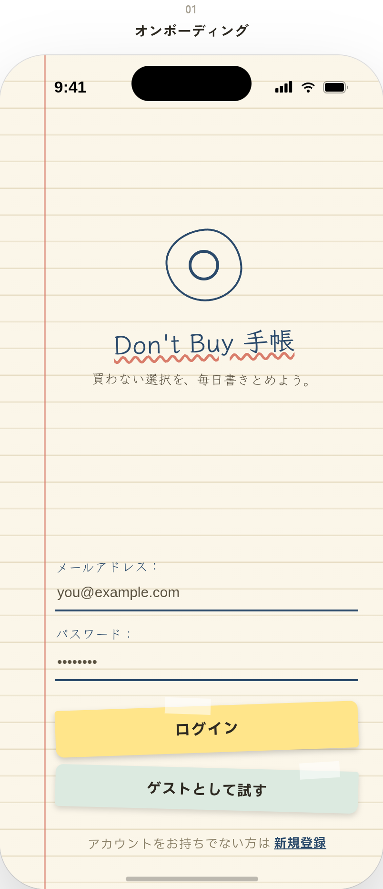

**English** | [日本語](README_ja.md)

# Don't Buy

> Current status: concept and design phase
> `./mock-image` will be removed once the frontend design work is complete.

> `./mock-image` will be removed once the frontend design work is complete.

## Is there something you want?

Even when there's something you want, the bigger the price tag, the more you hesitate over whether it's really okay to buy it — and that hesitation keeps you from actually going through with the purchase.

With Don't Buy, simply recording something you were planning to buy turns the amount you resisted spending into savings.

The money you would have lost in the real world turns directly into savings instead — that's the Don't Buy approach.

Once you reach your goal, you can look back through a history of everything you saved on and everything you resisted buying.

The more restraint you build up, the lower the hurdle becomes the next time you want to buy something, making it easier to go through with the purchase without strain.

> [Detailed concept](./docs/concept.md) (Japanese)

## Planned Features (rough sketch)

- UI and registration flow for instantly converting a purchase you were about to make into a "saved" entry
- Statistics UI for looking back over your savings history
- Motivational displays like "You saved ¥XX,XXX this month!" or "Your actions today/this week/this month got you X% closer to your goal!"
- Registering multiple goal items at once (unlimited, free)
- Login functionality
- A guest login user for portfolio purposes (may be a bit off the main track)
- Anything else that comes up...
- "BUY" mode shows a list of items you want to buy along with how full each item's savings gauge is; "Don't Buy" mode shows your savings history and the entry screen. The two modes switch with a single button and each has its own theme.
- Dark mode (dusk theme): not perfectly dark

For the more detailed feature design, data model, and technology choices, see [docs/plan.md](docs/plan.md) (Japanese).

## Tech Stack

| Layer    | Stack         | Language   |
| -------- | ------------- | ---------- |
| Frontend | Next.js/React | TypeScript |
| Backend  | Next.js       | TypeScript |
| DB       | Supabase      | PostgreSQL |

## Setup

Local development setup instructions will be added after implementation.

## Images

> `./mock-image` will be removed once the frontend design work is complete.

## License

The code in this repository is published for portfolio viewing purposes. Unauthorized reproduction or redistribution is prohibited.
